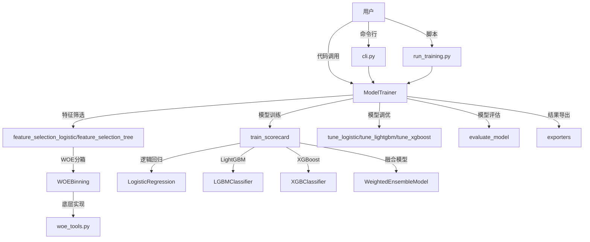

# min_model 项目 Code Wiki

## 1. 项目概述

`min_model` 是从原始仓库中提炼出来的最小可运行建模项目，旨在提供一套更适合维护、测试和继续演进的主干代码。

### 项目目标
- 不影响原始仓库内容
- 提炼统一训练主干
- 将历史项目、日志、模型产物和大体量数据与主干代码分离
- 为后续模块拆分、补测试和部署保留清晰结构

### 支持的模型类型
- **logistic**：逻辑回归评分卡（WOE分箱、IV筛选、VIF多重共线性、相关性筛选）
- **lightgbm**：LightGBM树模型（直接使用原始特征，导出PMML）
- **xgboost**：XGBoost树模型（直接使用原始特征，导出PMML）
- **ensemble**：融合模型（XGBoost + LightGBM加权融合）

## 2. 项目架构

### 目录结构

```text
min_model/
  src/
    risk_model/            # 核心模型代码
      __init__.py
      trainer.py           # 统一训练入口
      woe.py               # WOE分箱实现
      cli.py               # 命令行接口
      exporters/           # 导出功能
      utils/               # 工具函数
        __init__.py
        woe_tools.py       # WOE计算的底层实现
        paths.py           # 路径工具
  tests/
    test_model_trainer.py  # 集成测试脚本
  configs/
    default_config.json    # 默认配置文件
  docs/                    # 文档
  scripts/                 # 脚本
    run_training.py        # 训练脚本
  legacy/                  # 遗留代码
  .gitignore
  pyproject.toml
  requirements.txt
  README.md
```

### 核心模块关系



## 3. 核心模块详解

### 3.1 模型训练模块 (trainer.py)

**职责**：提供统一的模型训练接口，支持多种模型类型，包括数据加载、特征筛选、模型训练、调优和评估。

**主要功能**：
- 数据加载与预处理
- 数据集划分（训练集、测试集、OOT验证集）
- 特征筛选（逻辑回归：IV+VIF+相关性；树模型：特征重要性）
- 模型训练与调优（使用Optuna进行超参数搜索）
- 模型评估（计算AUC、KS、Gini等指标）
- 结果导出（模型文件、变量清单、ROC图、训练报告、评分卡、PMML文件）

**关键类**：
- `ModelTrainer`：风控模型统一训练器
- `WeightedEnsembleModel`：加权融合模型
- `CalibratedModelWrapper`：概率校准模型包装器

### 3.2 WOE分箱模块 (woe.py)

**职责**：实现WOE（Weight of Evidence）分箱功能，用于逻辑回归模型的特征转换。

**主要功能**：
- 数值型特征的分箱
- 类别型特征的处理
- WOE值计算
- IV（Information Value）计算
- 单调性检查

**关键类**：
- `WOEBinning`：WOE分箱实现

### 3.3 WOE工具模块 (utils/woe_tools.py)

**职责**：提供WOE计算的底层实现，包括分箱、WOE值计算、IV计算等。

**主要功能**：
- 分箱计算
- WOE值计算
- IV值计算
- 特征转换

**关键函数**：
- `var_bin`：变量分箱
- `calc_woe_details`：计算WOE详细信息
- `transform`：特征转换

### 3.4 命令行接口模块 (cli.py)

**职责**：提供命令行界面，方便用户通过命令行运行模型训练。

**主要功能**：
- 解析命令行参数
- 加载配置文件
- 调用ModelTrainer进行模型训练
- 输出训练结果

## 4. 关键类与函数说明

### 4.1 ModelTrainer 类

**描述**：风控模型统一训练器，是整个项目的核心类。

**主要方法**：

| 方法名 | 描述 | 参数 | 返回值 |
|-------|------|------|-------|
| `__init__` | 初始化训练器 | config: 配置字典 | None |
| `load_data` | 加载数据 | data_path: 数据路径 | DataFrame |
| `split_data_by_date` | 按日期划分数据 | data: 数据, date_col: 日期列, y_name: 目标列 | train, test, oot |
| `feature_selection_logistic` | 逻辑回归特征筛选 | data: 数据, y_name: 目标列 | 筛选后的特征列表 |
| `feature_selection_tree` | 树模型特征筛选 | data: 数据, y_name: 目标列, model_type: 模型类型 | 筛选后的特征列表 |
| `tune_logistic` | 调优逻辑回归模型 | X_train, y_train, X_test, y_test | 最佳参数 |
| `tune_lightgbm` | 调优LightGBM模型 | X_train, y_train, X_test, y_test | 最佳参数 |
| `tune_xgboost` | 调优XGBoost模型 | X_train, y_train, X_test, y_test | 最佳参数 |
| `train_scorecard` | 训练评分卡模型 | data: 数据, model_type: 模型类型 | model, metrics, var_list |
| `evaluate_model` | 评估模型性能 | y_true, y_pred, prefix | 评估指标字典 |

### 4.2 WOEBinning 类

**描述**：WOE分箱实现，用于逻辑回归模型的特征转换。

**主要方法**：

| 方法名 | 描述 | 参数 | 返回值 |
|-------|------|------|-------|
| `__init__` | 初始化WOE分箱器 | min_bins: 最小分箱数, max_bins: 最大分箱数, bin_pct: 分箱最小占比 | None |
| `fit` | 拟合分箱 | data: 数据, var: 变量名, y_name: 目标列 | 分箱详情DataFrame |
| `transform` | 转换特征 | data: 数据, var: 变量名 | 转换后的特征 |
| `get_iv` | 获取变量的IV值 | var: 变量名 | IV值 |

### 4.3 WeightedEnsembleModel 类

**描述**：加权融合模型，用于融合多个基模型的预测结果。

**主要方法**：

| 方法名 | 描述 | 参数 | 返回值 |
|-------|------|------|-------|
| `__init__` | 初始化融合模型 | models: 基模型列表, weights: 权重列表 | None |
| `predict_proba` | 预测概率 | X: 特征矩阵 | 预测概率 |

### 4.4 核心工具函数

| 函数名 | 描述 | 模块 |
|-------|------|------|
| `var_bin` | 变量分箱 | utils/woe_tools.py |
| `calc_woe_details` | 计算WOE详细信息 | utils/woe_tools.py |
| `transform` | 特征转换 | utils/woe_tools.py |
| `run_cli` | 运行命令行接口 | cli.py |

## 5. 配置说明

### 5.1 默认配置文件 (configs/default_config.json)

配置文件包含以下主要部分：

- **基础配置**：随机种子、输出目录、模型前缀
- **评分卡配置**：目标变量名、ID变量、日期列、测试集大小、OOT验证集大小
- **特征选择配置**：缺失值阈值、KS阈值、最大特征数、最小特征数
- **逻辑回归配置**：IV阈值、VIF阈值、相关性阈值、WOE分箱数
- **调优配置**：是否启用调优、调优次数、目标指标
- **评分卡参数**：PDO、基础分数、基础赔率
- **融合模型配置**：权重配置

### 5.2 配置示例

```json
{
  "seed": 1234,
  "output_dir": "./output",
  "model_prefix": "model",
  "scorecard": {
    "y_name": "target",
    "id_var": "order_id",
    "date_col": "endDateDuration",
    "test_size": 0.2,
    "oot_size": {
      "low_num": 1000,
      "high_num": 3000,
      "threshold": 7000
    },
    "feature_selection": {
      "missing_threshold": 0.95,
      "ks_threshold": 0.02,
      "max_features": 20,
      "min_features": 10
    },
    "logistic": {
      "iv_threshold": 0.02,
      "vif_threshold": 5.0,
      "corr_threshold": 0.7,
      "woe_bins": 10
    },
    "tuning": {
      "enable": true,
      "n_trials": 30,
      "target": "ks"
    },
    "scorecard_params": {
      "pdo": 40,
      "base_score": 600,
      "base_odds": 20
    }
  }
}
```

## 6. 依赖关系

### 核心依赖

| 依赖包 | 版本/说明 | 用途 |
|-------|----------|------|
| pandas | 数据处理库 | 数据加载、处理和分析 |
| numpy | 数值计算库 | 数值计算和数组操作 |
| scikit-learn | 机器学习库 | 逻辑回归、模型评估、交叉验证 |
| lightgbm | 梯度提升框架 | LightGBM模型训练 |
| xgboost | 梯度提升框架 | XGBoost模型训练 |
| optuna | 超参数优化库 | 模型超参数调优 |
| matplotlib | 可视化库 | 绘制ROC曲线和特征重要性图 |
| statsmodels | 统计分析库 | 计算VIF（方差膨胀因子） |
| joblib | 序列化库 | 模型保存和加载 |

### 可选依赖

| 依赖包 | 版本/说明 | 用途 |
|-------|----------|------|
| sklearn2pmml | PMML导出库 | 导出模型为PMML格式 |
| sklearn_pandas | 数据处理库 | 数据转换和预处理 |

## 7. 项目运行方式

### 7.1 安装依赖

在项目根目录下执行：

```bash
# 可编辑安装（推荐，便于修改代码）
pip install -e .

# 或直接安装依赖
pip install -r requirements.txt
```

### 7.2 运行集成测试

```bash
python tests/test_model_trainer.py
```

该脚本会依次训练：
- 逻辑回归评分卡
- LightGBM
- XGBoost

### 7.3 单独运行训练脚本

```bash
# 使用默认数据
python scripts/run_training.py data.pkl

# 使用自定义数据
python scripts/run_training.py 你的数据路径.pkl
```

### 7.4 使用命令行接口

```bash
# 逻辑回归
python -m risk_model.cli data.pkl --model-type logistic --config configs/default_config.json

# LightGBM
python -m risk_model.cli data.pkl --model-type lightgbm --config configs/default_config.json

# XGBoost
python -m risk_model.cli data.pkl --model-type xgboost --config configs/default_config.json
```

如果已经执行过 `pip install -e .`，还可以直接使用：

```bash
risk-model data.pkl --model-type lightgbm
```

### 7.5 在代码中调用

```python
from risk_model import ModelTrainer
import pandas as pd

data = pd.read_pickle("data.pkl")
trainer = ModelTrainer()
model, metrics, var_list = trainer.train_scorecard(
    data=data,
    model_type="logistic",
)
```

## 8. 输出结果

训练完成后，默认会在 `output` 目录下生成以下文件：

- **模型文件**：`.pkl` 格式的模型文件
- **变量清单**：`.csv` 格式的变量列表
- **ROC图**：`.png` 格式的ROC曲线
- **训练报告**：`.xlsx` 格式的训练报告
- **评分卡**：`.xlsx` 格式的评分卡（仅逻辑回归）
- **PMML文件**：`.pmml` 格式的模型文件（树模型且环境支持时）

## 9. 模型训练流程

### 9.1 逻辑回归模型训练流程

1. 数据加载与预处理
2. 按日期或随机划分数据集（训练集、测试集、OOT验证集）
3. 特征筛选：
   - 树模型预筛选（缩小候选范围）
   - IV筛选（选择IV值大于阈值的特征）
   - 相关性筛选（移除高相关性特征）
   - VIF筛选（移除高共线性特征）
4. WOE分箱：对筛选后的特征进行WOE分箱
5. 模型调优：使用Optuna进行超参数搜索
6. 模型训练：使用最佳参数训练逻辑回归模型
7. 模型评估：计算AUC、KS、Gini等指标
8. 结果导出：导出模型文件、变量清单、ROC图、训练报告、评分卡

### 9.2 树模型训练流程

1. 数据加载与预处理
2. 按日期或随机划分数据集（训练集、测试集、OOT验证集）
3. 特征筛选：
   - 训练初步模型获取特征重要性
   - 选择重要性大于0的特征
   - 特征稳定性筛选（PSI筛选）
   - 按重要性选择Top-N特征
4. 特征工程：添加特征交互项
5. 模型调优：使用Optuna进行超参数搜索
6. 模型训练：使用最佳参数训练树模型
7. 模型评估：计算AUC、KS、Gini等指标
8. 结果导出：导出模型文件、变量清单、ROC图、训练报告、PMML文件

### 9.3 融合模型训练流程

1. 数据加载与预处理
2. 按日期或随机划分数据集（训练集、测试集、OOT验证集）
3. 特征筛选：同树模型
4. 特征工程：添加特征交互项
5. 模型调优：分别调优XGBoost和LightGBM模型
6. 模型训练：训练XGBoost和LightGBM模型
7. 模型融合：按权重融合两个模型的预测结果
8. 模型评估：计算AUC、KS、Gini等指标
9. 结果导出：导出模型文件、变量清单、ROC图、训练报告

## 10. 代码优化建议

1. **模块拆分**：将 `trainer.py` 拆分成更细的模块，如：
   - `data_loader.py`：数据加载和预处理
   - `feature_selector.py`：特征筛选
   - `model_tuner.py`：模型调优
   - `model_evaluator.py`：模型评估
   - `result_exporter.py`：结果导出

2. **测试完善**：增加真正的单元测试，而不只是集成脚本

3. **配置优化**：将配置改成YAML或JSON驱动，支持更灵活的配置

4. **CLI增强**：为训练、预测、导出分别提供CLI子命令

5. **文档完善**：为每个模块和函数添加详细的文档字符串

6. **异常处理**：增加更完善的异常处理机制

7. **性能优化**：对大规模数据的处理进行性能优化

8. **模型监控**：添加模型监控和漂移检测功能

## 11. 常见问题与解决方案

### 11.1 数据格式问题

**问题**：数据文件格式不支持
**解决方案**：目前支持 `.pkl`、`.csv`、`.xlsx`、`.xls` 格式的数据文件。如果使用其他格式，需要先转换为支持的格式。

### 11.2 依赖缺失问题

**问题**：缺少必要的依赖库
**解决方案**：执行 `pip install -r requirements.txt` 安装所有依赖。

### 11.3 特征数量不足问题

**问题**：特征筛选后特征数量不足
**解决方案**：调整配置文件中的 `min_features` 参数，或放宽 `iv_threshold`、`corr_threshold` 等筛选阈值。

### 11.4 模型调优时间过长问题

**问题**：使用Optuna调优时时间过长
**解决方案**：调整配置文件中的 `n_trials` 参数，减少调优次数。

### 11.5 PMML导出失败问题

**问题**：PMML导出功能不可用
**解决方案**：安装 `sklearn2pmml` 和 `sklearn_pandas` 库：`pip install sklearn2pmml sklearn_pandas`。

## 12. 总结

`min_model` 是一个轻量级的风控模型训练框架，提供了统一的训练接口，支持多种模型类型，包括逻辑回归、LightGBM、XGBoost和融合模型。它具有以下特点：

- **统一接口**：提供统一的训练接口，支持多种模型类型
- **特征筛选**：内置多种特征筛选方法，包括IV、VIF、相关性和特征重要性
- **模型调优**：使用Optuna进行自动超参数调优
- **模型评估**：提供全面的模型评估指标
- **结果导出**：支持多种格式的结果导出
- **灵活配置**：通过配置文件灵活调整训练参数

该项目为风控模型的开发和部署提供了一个简洁、高效的框架，适合作为生产环境中的基础模型训练工具。